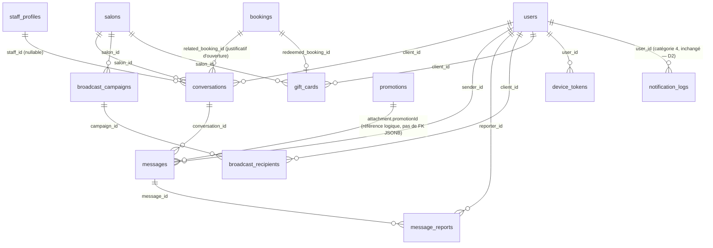
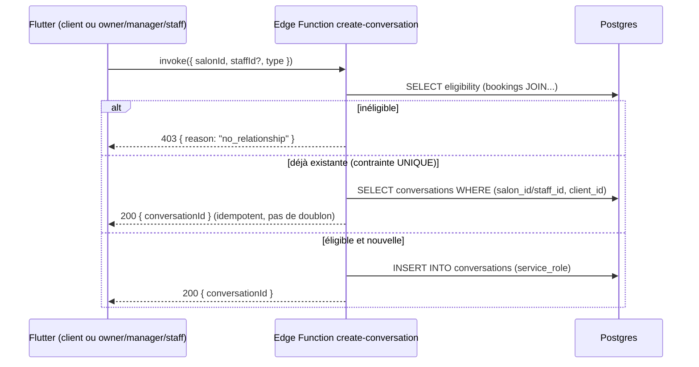
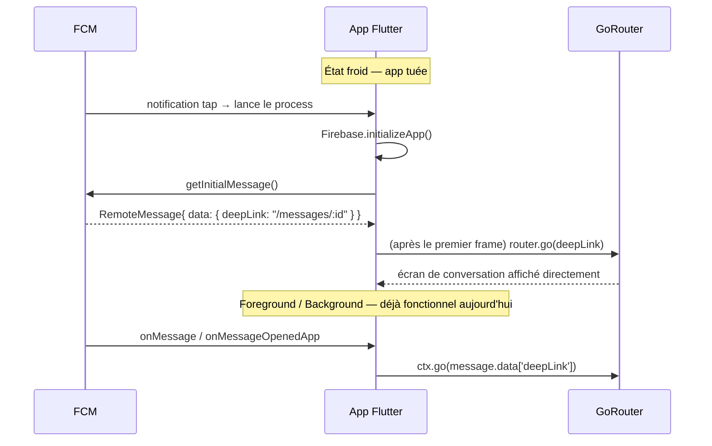

# KYNZA Messages — Architecture (Phase 0, documents only)

> Doc canonique unique pour la messagerie native KYNZA. Écrit sur la base d'un audit direct du
> dépôt (voir §1, état vérifié le 2026-07-16 — grep/lecture directe, pas de supposition), et des
> décisions verrouillées D1/D2/D3 du cahier des charges v2. **Aucun code de production n'a été
> écrit pour produire ce document.** Étend `docs/ARCHITECTURE.md` (conventions RLS/soft-delete),
> `docs/DATABASE_ARCHITECTURE.md` (catalogue des 55 tables existantes), `docs/OFFLINE_STRATEGY.md`
> (mécanisme outbox) et `docs/BOTTOM_NAVIGATION_GUIDE.md` (dette ShellRoute) — ces documents ne
> sont pas dupliqués ici, seulement cités et, pour deux d'entre eux, un besoin de mise à jour
> future est signalé (§12).

---

## 1. État vérifié du dépôt (rappel, ne pas resupposer)

Résumé du rapport d'écart déjà validé — voir le tableau complet dans l'échange qui a précédé ce
document. Points structurants pour la conception qui suit :

- **Navigation** : 4 jeux de tabs distincts par rôle, chacun piloté par un `int _tabIndex` local +
  `switch`. Aucun `ShellRoute`. `route_names.dart` est une classe abstraite de constantes `String`
  + 8 helpers `xPath(...)`, pas un système typé. `app_router.dart` = liste plate de ~80 `GoRoute`
  via un unique helper `_fadeRoute()`, gardées par `_RoleGuard`/`_RoleGuard.anyOf`/
  `_SystemAdminGuard`. `DeepLinkHandler.parseRoute(Uri)` fait un `switch(uri.host)` fermé sur 4 cas.
- **Base de données** : pattern RLS = `public.has_role(_uid, _role, _salon_id)`, fonction SQL
  `SECURITY INVOKER STABLE`, définie une seule fois
  (`20260623120000_users_schema_rls_hardening.sql`). `notification_logs` /
  `notification_preferences` / `notification_templates` déjà en place et alimentées uniquement par
  l'Edge Function `send-notification` (`service_role`, jamais de trigger DB). `pg_cron` et `pg_net`
  sont activés et utilisés (cron d'annulation des réservations expirées, rappels 24h/2h). Aucun
  compteur incrémental de non-lus n'existe : le badge actuel (`notifications` feature) recompte
  côté client à chaque émission Realtime sur un `.stream()` non borné — pattern documenté comme 46×
  plus lent à 400k lignes, **à ne pas reproduire**.
- **FCM** : un seul `users.fcm_token` (pas de multi-device). Deep link géré en foreground/background
  mais **pas** en cold start (`getInitialMessage()` absent). `send-notification` +
  `_shared/fcm.ts` (API FCM v1, envoi mono-token, best-effort, ne lève jamais).
- **Offline** : `MutationOutboxService` + `OfflineSyncCoordinator` existent réellement (Hive, JSON
  brut, pas de `TypeAdapter`). Retry = compteur d'essais (max 3) → dead-letter, **sans backoff
  temporel**. Aucune résolution de conflit générique. Le fichier `docs/ai/skills/kynza-offline-realtime.md`
  décrit une infrastructure (`hive_service.dart`, `conflict_resolver.dart`, `realtime_service.dart`)
  **qui n'existe pas** — non utilisé comme référence ici.
- **Design system** : `AppColors`/`AppTypography`/`AppRadius`/`AppShadows`/`AppDurations` conformes
  aux attentes. `KynzaSkeleton` et `KynzaCard` existent et sont repris tels quels (code complet
  vérifié). Aucune bulle de chat n'existe ; l'encart "réponse du propriétaire" dans `ReviewTile`
  est l'analogue le plus proche (bloc unique, pas d'alignement gauche/droite).
- **Repos/modèles/providers** (`lib/features/reviews/` comme référence) : modèles `@freezed` +
  `json_serializable` (`part '*.freezed.dart'`/`part '*.g.dart'`, `fromSupabase` = alias de
  `fromJson`), repository = interface abstraite + impl `SupabaseService.from(table)` avec
  try/catch → `AppException` localisée, providers Riverpod **classiques** (`Provider`,
  `FutureProvider.autoDispose.family`, `AsyncNotifierProvider`) — **pas** de `@riverpod` codegen
  dans ce module de référence.
- **Entités déjà existantes pertinentes pour les rich cards** : `promotions` (titre, description,
  réduction, `promo_code UNIQUE`, dates) — **aucune table `gift_cards`** n'existe (le module
  loyalty est un système de tampons, `loyalty_cards`/`loyalty_stamp_logs`, pas des cartes-cadeaux
  monétaires). `marketing` a déjà des écrans (`promotion_center_screen.dart`,
  `loyalty_setup_screen.dart`) mais pas de table de campagnes de diffusion.
- **Un badge existant à réutiliser** : `KynzaNavItem.badgeCount` (int, plafonné à `99+`, affiché en
  rouge) est déjà un champ du composant `KynzaBottomNav` — aucun onglet ne l'utilise encore
  aujourd'hui, mais le plumbing existe (voir `docs/BOTTOM_NAVIGATION_GUIDE.md` §Badges : "à l'écran
  appelant de calculer le compte et de le passer directement").

---

## 2. Décisions verrouillées (rappel D1/D2/D3)

- **D1** — Refactor `StatefulShellRoute` **avant** Messages, un chantier séparé et validé seul.
- **D2** — Catégorie 4 (KYNZA → Utilisateur) reste dans `notification_*` ; unification uniquement
  à l'affichage (mapping de présentation), aucune migration de données.
- **D3** — `getInitialMessage()` cold-start + `device_tokens` multi-device sont un **prérequis
  Phase 1**, avant toute messagerie fonctionnelle.

---

## 3. Analyse d'impact

| Zone touchée | Nature du changement | Risque |
|---|---|---|
| `lib/core/router/app_router.dart`, `route_names.dart`, `deep_link_handler.dart` | Extension additive (nouvelles routes/constantes/cas `switch`), puis refonte structurelle (D1) | **Élevé** pour D1 — touche les 4 écrans de rôle ; **faible** pour l'ajout de routes Messages (pattern déjà éprouvé) |
| `lib/core/services/notification_service.dart`, `main.dart` | Ajout `getInitialMessage()`, migration de la persistance du token vers `device_tokens` | Moyen — touche un chemin d'auth-boot déjà fragile (`AuthBootGate`) |
| `lib/core/services/mutation_outbox_service.dart`, `offline_sync_coordinator.dart` | Extension additive (nouveau `OutboxMutationType`, nouveau champ `nextRetryAt`) | Faible — mécanisme généralisé dès l'origine pour ça |
| Supabase — nouvelles tables | 7 nouvelles tables, 0 table existante modifiée en schéma (sauf lecture de `promotions`/`bookings`/`staff_profiles`) | Faible — additif pur |
| `notification_logs`/`notification_preferences`/`notification_templates` | **Aucune modification** (D2) | Nul |
| Design system (`AppColors`, `AppTypography`, `KynzaCard`, `KynzaSkeleton`) | Lecture seule, aucune extension nécessaire | Nul |
| Supabase Realtime / quota Free | Nouveaux canaux (par thread ouvert + par liste de conversations) | Moyen — à chiffrer avant Phase 3 large (voir §9) |

---

## 4. Inventaire réutilisation vs création (preuve anti-inflation)

### Réutilisé tel quel (aucune duplication)

| Mécanisme existant | Fichier | Usage dans Messages |
|---|---|---|
| `public.has_role(_uid, _role, _salon_id)` | `20260623120000_users_schema_rls_hardening.sql` | Toutes les policies RLS owner/manager des nouvelles tables |
| `send-notification` + `_shared/fcm.ts` | `supabase/functions/` | `_shared/fcm.ts` importé tel quel par la nouvelle fonction `send-message-push` (§7.4) ; `send-notification` et `notification_logs` **non touchés** (D2) |
| `MutationOutboxService` | `lib/core/services/mutation_outbox_service.dart` | Nouveau `OutboxMutationType.messageSend`, aucun nouveau service de queue |
| `OfflineSyncCoordinator` | `lib/core/services/offline_sync_coordinator.dart` | Nouveau `case` dans `_apply`/`_isAlreadySatisfied`, nouvelle dépendance `messageRepository` au constructeur |
| `KynzaSkeleton`, `KynzaCard` | `lib/shared/widgets/` | États de chargement de l'inbox et du thread ; les rich cards héritent de `KynzaCard` |
| `AppColors`/`AppTypography`/`AppRadius`/`AppShadows`/`AppDurations` | `lib/core/constants/` | Tous les nouveaux widgets, zéro couleur/style brut |
| `DeepLinkHandler.parseRoute` | `lib/core/router/deep_link_handler.dart` | Nouveau `case 'conversation':` dans le même `switch` fermé |
| `_fadeRoute` / `_RoleGuard` / `_RoleGuard.anyOf` | `app_router.dart` | Toutes les nouvelles routes suivent le même helper, aucun nouveau mécanisme de transition |
| `RouteNames` (constantes + helpers `xPath`) | `route_names.dart` | Nouvelles constantes ajoutées au même endroit, même style |
| `KynzaNavItem.badgeCount` | `lib/shared/navigation/kynza_nav_item.dart` | Alimenté par un `ref.watch` sur le nouveau provider d'agrégat non-lus (§8), **aucun `NavBadgeNotifier` global créé** — conforme à l'avertissement explicite du guide existant |
| `KynzaOfflineBanner` | `lib/shared/widgets/` | Réutilisé tel quel dans l'écran de conversation et l'inbox |
| Pattern repo/modèle/provider de `reviews` | `lib/features/reviews/` | Copié comme squelette pour `lib/features/messaging/` (freezed+json_serializable, Provider/FutureProvider/AsyncNotifierProvider classiques) |
| `promotions` (table existante) | `20260624090000_phase3a_schema.sql` | Référencée par `messages.attachment` (`promotionId`), **jamais dupliquée** |
| `pg_cron`/`pg_net` (extensions déjà actives) | — | Réutilisables si un job périodique est nécessaire plus tard (ex. purge des `gift_cards` expirées) ; **non utilisées pour déclencher le push** (voir §7.4, choix de cohérence avec le pattern existant) |

### Créé (nouveau, justifié)

| Élément nouveau | Justification anti-inflation |
|---|---|
| Tables `conversations`, `messages`, `broadcast_campaigns`, `broadcast_recipients`, `gift_cards`, `device_tokens`, `message_reports` | Aucune ne recoupe une table existante (vérifié par grep sur `message*`/`chat*`/`conversation*`/`thread*`/`gift_card*`/`device_token*` — zéro résultat) |
| Edge Functions `create-conversation`, `send-message-push`, `create-broadcast`, `redeem-gift-card` | Miroir du pattern déjà établi (`create-booking` pour l'atomicité serveur-autoritaire, `_shared/fcm.ts` réutilisé) — pas un nouveau pattern |
| `lib/features/messaging/` (domain/data/application/presentation) | Feature-first, calqué sur `reviews/` — aucune structure alternative inventée |
| `KynzaMessageBubble`, `KynzaGiftCardCard`, `KynzaPromotionCard`, `KynzaBookingConfirmationCard` | Composés de `KynzaCard` + tokens existants ; aucun équivalent trouvé (le bloc "réponse" de `ReviewTile` n'a ni alignement directionnel ni avatar) |
| Champ `nextRetryAt` sur les items de `MutationOutboxService` + logique de backoff dans `OfflineSyncCoordinator.flush()` | Le mécanisme existant n'a **aucun** backoff (compteur d'essais seulement) — extension minimale, pas un second système de queue |
| `StatefulShellRoute` (×4, un par rôle) | Remplace, ne duplique pas, le `_tabIndex` local — c'est la dette documentée dans `BOTTOM_NAVIGATION_GUIDE.md` que ce chantier résorbe |

---

## 5. Modèle de données

### 5.1 Vue d'ensemble (ER, tables nouvelles en gras)



### 5.2 `conversations`

```sql
CREATE TABLE public.conversations (
  id UUID PRIMARY KEY DEFAULT gen_random_uuid(),
  salon_id UUID NOT NULL REFERENCES public.salons(id),
  type TEXT NOT NULL CHECK (type IN ('client_salon','client_staff')),
  client_id UUID NOT NULL REFERENCES public.users(id),
  staff_id UUID REFERENCES public.staff_profiles(id),
  related_booking_id UUID REFERENCES public.bookings(id),

  last_message_at TIMESTAMPTZ,
  last_message_preview TEXT,
  client_unread_count INT NOT NULL DEFAULT 0,
  salon_unread_count INT NOT NULL DEFAULT 0,

  client_pinned BOOLEAN NOT NULL DEFAULT false,
  salon_pinned BOOLEAN NOT NULL DEFAULT false,
  client_hidden_at TIMESTAMPTZ,
  salon_hidden_at TIMESTAMPTZ,
  client_deleted_at TIMESTAMPTZ,
  salon_deleted_at TIMESTAMPTZ,
  client_archived BOOLEAN NOT NULL DEFAULT false,
  salon_archived BOOLEAN NOT NULL DEFAULT false,
  blocked_by UUID REFERENCES public.users(id),
  blocked_at TIMESTAMPTZ,

  created_at TIMESTAMPTZ NOT NULL DEFAULT NOW(),
  updated_at TIMESTAMPTZ NOT NULL DEFAULT NOW(),
  deleted_at TIMESTAMPTZ,

  CONSTRAINT chk_staff_type CHECK (type = 'client_salon' OR staff_id IS NOT NULL)
);

CREATE UNIQUE INDEX uq_conversations_client_salon
  ON public.conversations(salon_id, client_id) WHERE type = 'client_salon';
CREATE UNIQUE INDEX uq_conversations_client_staff
  ON public.conversations(staff_id, client_id) WHERE type = 'client_staff';
CREATE INDEX idx_conversations_client ON public.conversations(client_id, last_message_at DESC)
  WHERE deleted_at IS NULL;
CREATE INDEX idx_conversations_staff ON public.conversations(staff_id, last_message_at DESC)
  WHERE deleted_at IS NULL AND staff_id IS NOT NULL;
CREATE INDEX idx_conversations_salon ON public.conversations(salon_id, last_message_at DESC)
  WHERE deleted_at IS NULL;
```

**Simplification délibérée** : pas de table `conversation_participants` — une conversation n'a que
2 parties (client + "côté salon"), donc 2 colonnes FK suffisent. Si un jour un besoin de discussion
à N participants apparaît, migrer vers une table de jointure à ce moment-là, pas avant (règle
anti-inflation).

**"Masquer" vs "Archiver" vs "Supprimer"** : 3 actions du §10 du cahier des charges, 3 sémantiques
différentes, toutes par partie (client/salon indépendamment, jamais l'autre partie) :
- *Archiver* = rangement délibéré (`client_archived`/`salon_archived`, persistant).
- *Masquer* = désencombrement temporaire (`client_hidden_at`/`salon_hidden_at` ; la conversation
  redevient visible dès qu'un nouveau message arrive après cet horodatage — logique applicative,
  pas un trigger).
- *Supprimer* = retrait permanent **pour cette partie seulement** (`client_deleted_at`/
  `salon_deleted_at`), jamais un `DELETE` ni un effacement pour l'autre partie ni pour l'audit —
  cohérent avec la règle "soft delete only". La colonne `deleted_at` globale reste réservée à un
  effacement administratif/RGPD, jamais déclenchée par cette action utilisateur.

**Trigger de protection de colonnes** — nouveau, sur le même modèle que `protect_user_columns()`
(`20260623120000_users_schema_rls_hardening.sql`), car une policy RLS `UPDATE` ne peut pas à elle
seule restreindre *quelles colonnes* un `UPDATE` touche :

```sql
CREATE OR REPLACE FUNCTION public.protect_conversation_columns()
RETURNS TRIGGER LANGUAGE plpgsql SECURITY DEFINER AS $$
BEGIN
  IF auth.uid() = OLD.client_id THEN
    NEW.salon_pinned := OLD.salon_pinned;
    NEW.salon_archived := OLD.salon_archived;
    NEW.salon_hidden_at := OLD.salon_hidden_at;
    NEW.salon_deleted_at := OLD.salon_deleted_at;
  ELSE
    NEW.client_pinned := OLD.client_pinned;
    NEW.client_archived := OLD.client_archived;
    NEW.client_hidden_at := OLD.client_hidden_at;
    NEW.client_deleted_at := OLD.client_deleted_at;
  END IF;
  -- les compteurs/last_message_* ne sont modifiables que par le trigger serveur, jamais par un UPDATE client
  NEW.last_message_at := OLD.last_message_at;
  NEW.last_message_preview := OLD.last_message_preview;
  NEW.client_unread_count := OLD.client_unread_count;
  NEW.salon_unread_count := OLD.salon_unread_count;
  NEW.blocked_by := OLD.blocked_by;
  NEW.blocked_at := OLD.blocked_at;
  RETURN NEW;
END;
$$;
CREATE TRIGGER trg_protect_conversation_columns
  BEFORE UPDATE ON public.conversations
  FOR EACH ROW EXECUTE FUNCTION public.protect_conversation_columns();
```

**RLS** :

```sql
ALTER TABLE public.conversations ENABLE ROW LEVEL SECURITY;

CREATE POLICY "conversations_client_select" ON public.conversations
  FOR SELECT USING (client_id = auth.uid());

CREATE POLICY "conversations_staff_select" ON public.conversations
  FOR SELECT USING (
    staff_id IN (SELECT id FROM public.staff_profiles WHERE user_id = auth.uid())
  );

CREATE POLICY "conversations_owner_manager_select" ON public.conversations
  FOR SELECT USING (
    public.has_role(auth.uid(), 'owner', salon_id)
    OR public.has_role(auth.uid(), 'manager', salon_id)
  );

CREATE POLICY "conversations_client_update_own_state" ON public.conversations
  FOR UPDATE USING (client_id = auth.uid()) WITH CHECK (client_id = auth.uid());

CREATE POLICY "conversations_staff_update_own_state" ON public.conversations
  FOR UPDATE USING (staff_id IN (SELECT id FROM public.staff_profiles WHERE user_id = auth.uid()))
  WITH CHECK (staff_id IN (SELECT id FROM public.staff_profiles WHERE user_id = auth.uid()));

-- Pas de policy INSERT pour authenticated : création uniquement via l'Edge Function
-- create-conversation (service_role), qui applique la règle anti-spam (§6).
```

### 5.3 `messages`

```sql
CREATE TABLE public.messages (
  id UUID PRIMARY KEY DEFAULT gen_random_uuid(),
  conversation_id UUID NOT NULL REFERENCES public.conversations(id),
  sender_id UUID NOT NULL REFERENCES public.users(id),
  client_message_id UUID NOT NULL,
  kind TEXT NOT NULL CHECK (kind IN (
    'text','image','gif','gift_card','coupon','promotion','booking_confirmation'
  )),
  body TEXT,
  attachment JSONB,
  status TEXT NOT NULL CHECK (status IN ('sent','delivered','read')) DEFAULT 'sent',
  delivered_at TIMESTAMPTZ,
  read_at TIMESTAMPTZ,
  is_flagged BOOLEAN NOT NULL DEFAULT false,
  created_at TIMESTAMPTZ NOT NULL DEFAULT NOW(),
  updated_at TIMESTAMPTZ NOT NULL DEFAULT NOW(),
  deleted_at TIMESTAMPTZ,

  CONSTRAINT uq_message_client_dedup UNIQUE (conversation_id, sender_id, client_message_id)
);

CREATE INDEX idx_messages_conversation ON public.messages(conversation_id, created_at DESC)
  WHERE deleted_at IS NULL;
```

`client_message_id` (généré côté Flutter avec `uuid` — déjà une dépendance du projet) est la clé
d'idempotence : un renvoi par la file offline avec le même id ne crée pas de doublon
(`ON CONFLICT DO NOTHING` côté insert, ou vérification `_isAlreadySatisfied` côté
`OfflineSyncCoordinator`, §8).

**Modèle d'attachement discriminé** (`attachment JSONB`, day-one) :

```jsonc
// image
{ "type": "image", "url": "...", "width": 800, "height": 600, "thumbnailUrl": "..." }
// gif
{ "type": "gif", "url": "...", "width": 480, "height": 270 }
// gift_card — référence gift_cards.id, champs dénormalisés pour rendu offline
{ "type": "gift_card", "giftCardId": "uuid", "amountBif": 20000, "expiresAt": "2026-08-01T00:00:00Z" }
// coupon / promotion — référence promotions.id existante, jamais dupliquée en écriture
{ "type": "promotion", "promotionId": "uuid", "title": "...", "imageUrl": "..." }
// booking_confirmation — référence bookings.id existante
{ "type": "booking_confirmation", "bookingId": "uuid" }
```

Extensible sans refonte : un futur `{ "type": "pdf", ... }` / `"video"` / `"audio"` ajoute un cas au
`CHECK` de `kind` (migration additive) et un nouveau widget de rendu — la colonne `attachment`
elle-même n'a besoin d'aucun changement de type.

**RLS** :

```sql
ALTER TABLE public.messages ENABLE ROW LEVEL SECURITY;

CREATE POLICY "messages_participant_select" ON public.messages
  FOR SELECT USING (
    EXISTS (
      SELECT 1 FROM public.conversations c
      WHERE c.id = messages.conversation_id
        AND (
          c.client_id = auth.uid()
          OR c.staff_id IN (SELECT id FROM public.staff_profiles WHERE user_id = auth.uid())
          OR public.has_role(auth.uid(), 'owner', c.salon_id)
          OR public.has_role(auth.uid(), 'manager', c.salon_id)
        )
    )
  );

CREATE POLICY "messages_participant_insert" ON public.messages
  FOR INSERT WITH CHECK (
    sender_id = auth.uid()
    AND EXISTS (
      SELECT 1 FROM public.conversations c
      WHERE c.id = messages.conversation_id
        AND c.blocked_by IS NULL
        AND (
          c.client_id = auth.uid()
          OR (c.type = 'client_staff' AND c.staff_id IN (
                SELECT id FROM public.staff_profiles WHERE user_id = auth.uid()))
          OR (c.type = 'client_salon' AND (
                public.has_role(auth.uid(), 'owner', c.salon_id)
                OR public.has_role(auth.uid(), 'manager', c.salon_id)))
        )
    )
  );

CREATE POLICY "messages_recipient_mark_read" ON public.messages
  FOR UPDATE USING (
    sender_id <> auth.uid()
    AND EXISTS (
      SELECT 1 FROM public.conversations c
      WHERE c.id = messages.conversation_id
        AND (c.client_id = auth.uid()
             OR c.staff_id IN (SELECT id FROM public.staff_profiles WHERE user_id = auth.uid()))
    )
  )
  WITH CHECK (status = 'read');
```

Note volontaire : pour `client_salon`, owner **et** manager peuvent écrire (boîte partagée du
salon) ; pour `client_staff`, seul le staff assigné écrit (owner/manager gardent une supervision en
lecture seule, cohérent avec `notif_logs_owner_manager_select` déjà en place pour les
notifications).

### 5.4 Trigger de compteurs non-lus (incrémental, pas de `count(*)`)

```sql
CREATE OR REPLACE FUNCTION public.bump_conversation_on_message()
RETURNS TRIGGER LANGUAGE plpgsql AS $$
BEGIN
  UPDATE public.conversations SET
    last_message_at = NEW.created_at,
    last_message_preview = LEFT(COALESCE(NEW.body, '[' || NEW.kind || ']'), 140),
    client_unread_count = CASE
      WHEN NEW.sender_id <> client_id THEN client_unread_count + 1
      ELSE client_unread_count
    END,
    salon_unread_count = CASE
      WHEN NEW.sender_id = client_id THEN salon_unread_count + 1
      ELSE salon_unread_count
    END,
    client_hidden_at = CASE WHEN NEW.sender_id <> client_id THEN NULL ELSE client_hidden_at END,
    salon_hidden_at = CASE WHEN NEW.sender_id = client_id THEN NULL ELSE salon_hidden_at END,
    updated_at = NOW()
  WHERE id = NEW.conversation_id;
  RETURN NEW;
END;
$$;
CREATE TRIGGER trg_bump_conversation_on_message
  AFTER INSERT ON public.messages
  FOR EACH ROW EXECUTE FUNCTION public.bump_conversation_on_message();

CREATE OR REPLACE FUNCTION public.reset_unread_on_read()
RETURNS TRIGGER LANGUAGE plpgsql AS $$
BEGIN
  IF NEW.status = 'read' AND OLD.status <> 'read' THEN
    UPDATE public.conversations c SET
      client_unread_count = CASE WHEN NEW.sender_id <> c.client_id
        THEN GREATEST(client_unread_count - 1, 0) ELSE client_unread_count END,
      salon_unread_count = CASE WHEN NEW.sender_id = c.client_id
        THEN GREATEST(salon_unread_count - 1, 0) ELSE salon_unread_count END
    WHERE c.id = NEW.conversation_id;
  END IF;
  RETURN NEW;
END;
$$;
CREATE TRIGGER trg_reset_unread_on_read
  AFTER UPDATE OF status ON public.messages
  FOR EACH ROW EXECUTE FUNCTION public.reset_unread_on_read();
```

**Badge de la Bottom Nav** — décision anti-inflation prise pendant la conception : une table
dédiée `user_message_badges` a été envisagée puis **abandonnée**. Les compteurs par conversation
ci-dessus sont déjà bornés (nombre de conversations d'un utilisateur = dizaines, pas de milliers),
donc un `SUM()` sur `conversations` reste bon marché — pas besoin d'un second niveau
d'agrégation :

```sql
-- badge côté client
SELECT COALESCE(SUM(client_unread_count), 0) FROM public.conversations
WHERE client_id = auth.uid() AND deleted_at IS NULL;

-- badge côté staff
SELECT COALESCE(SUM(salon_unread_count), 0) FROM public.conversations
WHERE staff_id = (SELECT id FROM public.staff_profiles WHERE user_id = auth.uid())
  AND deleted_at IS NULL;

-- badge côté owner/manager (tout le salon)
SELECT COALESCE(SUM(salon_unread_count), 0) FROM public.conversations
WHERE salon_id = :salonId AND deleted_at IS NULL;
```

Ceci répond directement à l'exigence du §11 du cahier des charges ("éviter le `count(*)` naïf à
chaque render") sans reproduire l'anti-pattern déjà identifié dans le module notifications
(`watchUnreadCount()` qui recompte sur chaque émission Realtime d'un stream non filtré).

### 5.5 `broadcast_campaigns` / `broadcast_recipients` (catégorie 3 — diffusion)

Décision de conception : une diffusion à N clients n'est **pas** une conversation (cardinalité et
pattern d'accès radicalement différents — un message, potentiellement des milliers de
destinataires, pas de fil de discussion). La forcer dans le schéma `conversations`/`messages`
obligerait à créer une ligne de conversation par destinataire pour un seul envoi, ce qui contredit
"diffusion, pas conversation 1:1" du cahier des charges. Le schéma choisi **réutilise le pattern
déjà éprouvé de `notification_logs`** (ligne par destinataire, `is_read`/`read_at`), pas un
troisième pattern.

```sql
CREATE TABLE public.broadcast_campaigns (
  id UUID PRIMARY KEY DEFAULT gen_random_uuid(),
  salon_id UUID NOT NULL REFERENCES public.salons(id),
  created_by UUID NOT NULL REFERENCES public.users(id),
  title TEXT NOT NULL,
  body TEXT NOT NULL,
  attachment JSONB,
  audience_filter JSONB NOT NULL DEFAULT '{"segment":"all"}',
  sent_at TIMESTAMPTZ,
  recipient_count INT NOT NULL DEFAULT 0,
  created_at TIMESTAMPTZ NOT NULL DEFAULT NOW(),
  updated_at TIMESTAMPTZ NOT NULL DEFAULT NOW(),
  deleted_at TIMESTAMPTZ
);

CREATE TABLE public.broadcast_recipients (
  id UUID PRIMARY KEY DEFAULT gen_random_uuid(),
  campaign_id UUID NOT NULL REFERENCES public.broadcast_campaigns(id),
  client_id UUID NOT NULL REFERENCES public.users(id),
  is_read BOOLEAN NOT NULL DEFAULT false,
  read_at TIMESTAMPTZ,
  created_at TIMESTAMPTZ NOT NULL DEFAULT NOW(),
  CONSTRAINT uq_broadcast_recipient UNIQUE (campaign_id, client_id)
);
CREATE INDEX idx_broadcast_recipients_client
  ON public.broadcast_recipients(client_id, created_at DESC);
```

**RLS** :

```sql
ALTER TABLE public.broadcast_campaigns ENABLE ROW LEVEL SECURITY;
CREATE POLICY "broadcast_owner_manager_manage" ON public.broadcast_campaigns
  FOR ALL USING (
    public.has_role(auth.uid(), 'owner', salon_id)
    OR public.has_role(auth.uid(), 'manager', salon_id)
  );
CREATE POLICY "broadcast_recipient_select_campaign" ON public.broadcast_campaigns
  FOR SELECT USING (
    EXISTS (SELECT 1 FROM public.broadcast_recipients r
            WHERE r.campaign_id = broadcast_campaigns.id AND r.client_id = auth.uid())
  );

ALTER TABLE public.broadcast_recipients ENABLE ROW LEVEL SECURITY;
CREATE POLICY "broadcast_recipients_own_select" ON public.broadcast_recipients
  FOR SELECT USING (client_id = auth.uid());
CREATE POLICY "broadcast_recipients_own_mark_read" ON public.broadcast_recipients
  FOR UPDATE USING (client_id = auth.uid()) WITH CHECK (client_id = auth.uid());
CREATE POLICY "broadcast_recipients_owner_manager_select" ON public.broadcast_recipients
  FOR SELECT USING (
    EXISTS (SELECT 1 FROM public.broadcast_campaigns c
            WHERE c.id = broadcast_recipients.campaign_id
              AND (public.has_role(auth.uid(), 'owner', c.salon_id)
                   OR public.has_role(auth.uid(), 'manager', c.salon_id)))
  );
-- Pas de policy INSERT pour authenticated : le fan-out (potentiellement des milliers de lignes)
-- est fait par l'Edge Function create-broadcast (service_role), comme create-booking.
```

### 5.6 `gift_cards`

Aucune table de cartes-cadeaux n'existe (le module loyalty actuel est un système de tampons). Un
schéma minimal est nécessaire dès le jour 1 pour que la rich card "Carte cadeau" du §7 du cahier
des charges soit fonctionnelle (pas seulement un JSON flottant dans un message) :

```sql
CREATE TABLE public.gift_cards (
  id UUID PRIMARY KEY DEFAULT gen_random_uuid(),
  salon_id UUID NOT NULL REFERENCES public.salons(id),
  issued_by UUID NOT NULL REFERENCES public.users(id),
  client_id UUID NOT NULL REFERENCES public.users(id),
  amount_bif INT NOT NULL CHECK (amount_bif > 0),
  code TEXT NOT NULL UNIQUE,
  expires_at TIMESTAMPTZ NOT NULL,
  redeemed_at TIMESTAMPTZ,
  redeemed_booking_id UUID REFERENCES public.bookings(id),
  created_at TIMESTAMPTZ NOT NULL DEFAULT NOW(),
  updated_at TIMESTAMPTZ NOT NULL DEFAULT NOW(),
  deleted_at TIMESTAMPTZ
);
CREATE INDEX idx_gift_cards_client ON public.gift_cards(client_id) WHERE deleted_at IS NULL;

ALTER TABLE public.gift_cards ENABLE ROW LEVEL SECURITY;
CREATE POLICY "gift_cards_owner_manager_manage" ON public.gift_cards
  FOR ALL USING (
    public.has_role(auth.uid(), 'owner', salon_id)
    OR public.has_role(auth.uid(), 'manager', salon_id)
  );
CREATE POLICY "gift_cards_client_select_own" ON public.gift_cards
  FOR SELECT USING (client_id = auth.uid());
-- Rédemption uniquement via l'Edge Function redeem-gift-card (service_role), même schéma de
-- protection que loyalty_qr_tokens (used_at/used_by) contre le double usage.
```

### 5.7 `device_tokens` (prérequis D3)

```sql
CREATE TABLE public.device_tokens (
  id UUID PRIMARY KEY DEFAULT gen_random_uuid(),
  user_id UUID NOT NULL REFERENCES public.users(id),
  token TEXT NOT NULL,
  platform TEXT NOT NULL CHECK (platform IN ('android','ios')),
  last_seen_at TIMESTAMPTZ NOT NULL DEFAULT NOW(),
  created_at TIMESTAMPTZ NOT NULL DEFAULT NOW(),
  deleted_at TIMESTAMPTZ,
  CONSTRAINT uq_device_tokens_token UNIQUE (token)
);
CREATE INDEX idx_device_tokens_user ON public.device_tokens(user_id) WHERE deleted_at IS NULL;

ALTER TABLE public.device_tokens ENABLE ROW LEVEL SECURITY;
CREATE POLICY "device_tokens_own" ON public.device_tokens
  FOR ALL USING (user_id = auth.uid()) WITH CHECK (user_id = auth.uid());
```

Migration de données (une fois, non répétable) : `INSERT INTO device_tokens (user_id, token,
platform) SELECT id, fcm_token, 'android' FROM users WHERE fcm_token IS NOT NULL ON CONFLICT
(token) DO NOTHING;` — `platform` par défaut `'android'` faute d'info historique (à corriger au
prochain refresh de token de chaque utilisateur, où la plateforme réelle sera connue côté client).
`users.fcm_token` n'est **pas** supprimée en Phase 1 (pas de suppression de colonne dans ce
document — décision à valider séparément une fois `device_tokens` éprouvée en production), mais
`NotificationService.saveFcmToken` cesse de l'écrire au profit d'un upsert dans `device_tokens`.

### 5.8 `message_reports` (modération — "Signaler")

```sql
CREATE TABLE public.message_reports (
  id UUID PRIMARY KEY DEFAULT gen_random_uuid(),
  message_id UUID NOT NULL REFERENCES public.messages(id),
  reporter_id UUID NOT NULL REFERENCES public.users(id),
  reason TEXT NOT NULL,
  resolved_at TIMESTAMPTZ,
  resolved_by UUID REFERENCES public.users(id),
  created_at TIMESTAMPTZ NOT NULL DEFAULT NOW()
);

ALTER TABLE public.message_reports ENABLE ROW LEVEL SECURITY;
CREATE POLICY "message_reports_own_insert" ON public.message_reports
  FOR INSERT WITH CHECK (reporter_id = auth.uid());
CREATE POLICY "message_reports_own_select" ON public.message_reports
  FOR SELECT USING (reporter_id = auth.uid());
CREATE POLICY "message_reports_owner_manager_manage" ON public.message_reports
  FOR ALL USING (
    EXISTS (
      SELECT 1 FROM public.messages m JOIN public.conversations c ON c.id = m.conversation_id
      WHERE m.id = message_reports.message_id
        AND (public.has_role(auth.uid(), 'owner', c.salon_id)
             OR public.has_role(auth.uid(), 'manager', c.salon_id))
    )
  );

CREATE OR REPLACE FUNCTION public.flag_message_on_report()
RETURNS TRIGGER LANGUAGE plpgsql AS $$
BEGIN
  UPDATE public.messages SET is_flagged = true WHERE id = NEW.message_id;
  RETURN NEW;
END;
$$;
CREATE TRIGGER trg_flag_message_on_report
  AFTER INSERT ON public.message_reports
  FOR EACH ROW EXECUTE FUNCTION public.flag_message_on_report();
```

"Bloquer" n'a pas de table dédiée : c'est `conversations.blocked_by`/`blocked_at`, déjà modélisé
en §5.2 (§5.3 en tient compte dans la policy d'`INSERT` des messages). Aucune modération par IA —
conforme à la contrainte explicite du cahier des charges.

---

## 6. Règle anti-spam — éligibilité de création de conversation (serveur-autoritaire)

Le cahier des charges est strict : *"Le serveur refuse toute création de conversation hors de ces
conditions"*. Ceci ne peut pas être une policy RLS `INSERT` seule (la logique — historique de
réservation, initiative du salon — dépasse ce qu'une `WITH CHECK` déclarative exprime proprement) ;
comme pour `create-booking` (verrouillage atomique de créneau), c'est une **Edge Function**
`create-conversation` sous `service_role` qui fait le contrôle puis l'insertion.

**Portée day-one confirmée par les faits vérifiés** (aucune table d'"demande"/inquiry n'existe
actuellement dans le dépôt) :

- Éligibilité `client_salon` : `EXISTS (SELECT 1 FROM bookings WHERE salon_id = :salonId AND
  client_id = :clientId AND deleted_at IS NULL)` — au moins une réservation, peu importe le statut
  (couvre à la fois "après réservation" et "salon déjà fréquenté").
- Éligibilité `client_staff` : la même requête, filtrée en plus sur
  `practitioner_id = :staffId` — au moins un rendez-vous avec **ce** membre du staff précisément.
- **Point ouvert, non implémenté ici** : *"salon qui répond à une demande"* implique une entité de
  contact/demande sans réservation préalable (ex. un CTA "Contacter le salon" sur la fiche salon).
  Cette entité n'existe pas dans le dépôt actuel et n'est pas définie dans le cahier des charges au
  niveau du modèle de données. **Décision proposée** : la traiter comme une extension Phase future
  (`conversation_requests`, hors périmètre de ce document) plutôt que d'inventer un système
  d'inquiry non spécifié — à confirmer avant la Phase 3.

Séquence de création :



Les **messages** dans une conversation déjà autorisée, eux, passent par un `INSERT` client direct
via `supabase_flutter` (RLS-gated, §5.3) — pas d'aller-retour Edge Function, pour la latence
perçue ; ce choix suit le précédent `reviews` (écriture directe RLS) plutôt que le précédent
`bookings` (Edge Function), car il n'y a ici aucune contrainte d'atomicité multi-lignes à protéger
au niveau du message individuel (seule la *création de conversation* en a besoin).

---

## 7. Temps réel, statuts, notifications

### 7.1 Le piège à éviter (rappel du gap constaté)

`notification_repository_impl.dart` documente déjà, dans son propre code, qu'un `.stream()` non
filtré/non borné sur une table qui grossit indéfiniment est mesuré **46× plus lent à 400k lignes**.
Une messagerie génère un volume de lignes largement supérieur à celui des notifications sur la
durée de vie d'un salon actif — reproduire ce pattern sur `messages` serait un choix non défendable
dès la conception.

### 7.2 Stratégie retenue — realtime borné par construction

- **Thread ouvert** : `.stream()` filtré `eq('conversation_id', id)` sur `messages` — borné par
  définition (un fil de discussion, pas toute la table).
- **Liste des conversations (inbox)** : `.stream()` filtré `eq('client_id', uid)` (côté client) ou
  une vue équivalente filtrée `salon_id`/`staff_id` (côté salon) sur `conversations`, **pas** sur
  `messages`. Le nombre de lignes est borné par le nombre de relations d'un utilisateur (dizaines),
  pas par le nombre de messages échangés — categoriquement différent du piège observé.
- **Catégorie 4 (système)** : aucun changement, reste sur son mécanisme actuel (D2).

### 7.3 Statuts de message

`messages.status` (`sent`/`delivered`/`read`) — `sent` posé à l'`INSERT` ; `delivered` mis à jour
côté client destinataire dès réception du postgres_changes payload (pas un aller-retour serveur) ;
`read` mis à jour via la policy `messages_recipient_mark_read` (§5.3) quand le thread est affiché à
l'écran, ce qui déclenche `trg_reset_unread_on_read` (§5.4).

### 7.4 Push FCM + deep link (day-one et cold-start, D3)

Nouvelle Edge Function légère `send-message-push`, qui **importe `_shared/fcm.ts` sans le
modifier** et n'écrit **pas** dans `notification_logs` (réservée à la catégorie 4, D2) :

```ts
// supabase/functions/send-message-push/index.ts — esquisse, pas d'implémentation ici
import { sendFcmPush } from "../_shared/fcm.ts";
// input: { conversationId, messageId, recipientUserId, senderName, preview }
// 1. SELECT token FROM device_tokens WHERE user_id = recipientUserId AND deleted_at IS NULL
// 2. pour chaque token (multi-device) : sendFcmPush(token, {
//      title: senderName, body: preview,
//      data: { deepLink: "/messages/${conversationId}" }
//    })
// best-effort, même contrat que sendFcmPush existant (ne lève jamais)
```

**Pourquoi une Edge Function séparée plutôt qu'un trigger DB → `pg_net`** : `pg_cron`/`pg_net` sont
déjà actifs dans ce projet, mais **jamais** utilisés pour déclencher un push depuis un trigger — le
pattern établi (`send-notification`) est toujours une invocation explicite depuis le code appelant.
Introduire un déclenchement par trigger serait un troisième pattern inédit pour un gain marginal ;
la cohérence avec l'existant l'emporte. Le client Flutter invoque `send-message-push`
immédiatement après l'`INSERT` réussi du message.

**Deep link, y compris cold-start (ferme la dette D3)** :



`DeepLinkHandler.parseRoute` reçoit un nouveau cas dans son `switch(uri.host)` fermé existant :

```dart
case 'conversation':
  final id = _firstSegment(uri);
  return id == null ? null : RouteNames.messagesThreadPath(id);
```

(Ce cas sert aux liens `com.kynza.app://conversation/:id`, ex. partagés hors-app ; le deep-link FCM
lui-même transporte déjà un chemin `/messages/:id` direct, pas une URI à scheme custom — cohérent
avec le format `deepLink: "/booking/${id}"` déjà produit par `send-notification` aujourd'hui.)

---

## 8. Offline, cache, résolution de conflits

### 8.1 Extension du backoff (absent aujourd'hui — construction réelle, pas une réutilisation)

`MutationOutboxService` n'a aujourd'hui qu'un compteur d'essais. Extension minimale, additive,
sans nouveau service :

```dart
// mutation_outbox_service.dart — champ ajouté à l'item enqueue()
'nextRetryAt': DateTime.now(), // rejouable immédiatement au premier essai

// recordFailedAttempt() calcule désormais aussi le prochain essai (backoff exponentiel plafonné)
final delay = Duration(seconds: (30 * (1 << (attempts - 1))).clamp(30, 900)); // 30s, 60s, 120s... cap 15min
items[index] = {...items[index], 'attempts': attempts, 'nextRetryAt': DateTime.now().add(delay)};
```

```dart
// offline_sync_coordinator.dart — flush() ignore les items pas encore mûrs
for (final item in outbox.pending()) {
  final nextRetryAt = item['nextRetryAt'] as DateTime?;
  if (nextRetryAt != null && nextRetryAt.isAfter(DateTime.now())) continue;
  // ... reste identique
}
```

Nouveau tag `OutboxMutationType.messageSend`, nouveau `case` dans `_apply`/`_isAlreadySatisfied` de
`OfflineSyncCoordinator` (dépendance `messageRepository` ajoutée au constructeur, comme
`reviewRepository`/`dataDeletionRepository`/`clientProfileRepository` aujourd'hui) :

```dart
case OutboxMutationType.messageSend:
  // _isAlreadySatisfied : un message avec ce client_message_id existe déjà ? (dédup, §5.3)
  return await messageRepository.existsByClientMessageId(
    payload['conversationId'] as String, payload['clientMessageId'] as String,
  );
  // _apply : envoi réel via messageRepository.sendMessage(...)
```

### 8.2 Résolution de conflits — pas de mécanisme générique, stratégie dédiée aux messages

Comme documenté (§1), aucun `conflict_resolver.dart` générique n'existe et **aucun n'est créé ici**
— chaque domaine résout ses conflits selon sa propre nature, exactement comme
`bookings`/`reviews`/profil le font déjà. Pour les messages :

- **Ordering** : `created_at` serveur fait foi pour l'affichage (jamais l'horodatage client, non
  fiable hors-ligne) — le tri d'affichage se fait toujours sur la colonne serveur.
- **Dédoublonnage** : `client_message_id` + contrainte `UNIQUE(conversation_id, sender_id,
  client_message_id)` (§5.3) — un renvoi identique par la file offline ne crée jamais de doublon,
  qu'il soit détecté avant (`_isAlreadySatisfied`) ou qu'il échoue silencieusement côté DB
  (contrainte unique).
- **Pas de merge de contenu** : un message est immuable une fois envoyé (pas d'édition day-one, cf.
  §11 évolutivité) — il n'y a donc structurellement rien à fusionner, contrairement à un profil ou
  un avis.

### 8.3 Cache offline (Hive, même convention — JSON brut, pas de `TypeAdapter`)

Une nouvelle box `kynza_message_cache` (nommage cohérent avec `kynza_booking_cache`existante),
chiffrée comme les autres caches de lecture (`BookingReadCache`, `ProfileReadCache`,
`NotificationReadCache` sont chiffrées ; `SalonLocationCache`/`FeatureFlagCache` ne le sont pas —
les messages contenant des échanges personnels, la box suit le groupe chiffré). Contenu : les N
derniers messages par conversation récemment ouverte + la liste des conversations pour affichage
instantané hors-ligne — lecture seule, jamais la source de vérité (Supabase l'est toujours).

---

## 9. Contraintes de plan Supabase Free — à chiffrer, pas à ignorer

Le projet est actuellement sur le plan Free (déjà un facteur bloquant documenté pour RC-11 dans le
handbook de maintenance). Points à vérifier **avant** un déploiement large de la Phase 3, pas
maintenant :

- **Connexions Realtime concurrentes** : chaque utilisateur avec l'app Messages ouverte tient au
  plus 2 canaux (le thread ouvert + la liste des conversations, §7.2) — c'est le choix de
  conception qui *minimise* cette consommation, documenté comme tel, mais le nombre absolu
  d'utilisateurs simultanés × 2 doit être comparé au quota réel du plan au moment de
  l'implémentation (le quota exact évolue avec l'offre Supabase — ne pas figer un chiffre ici sans
  le revérifier).
- **Taille de base de données** : `messages`/`conversations` grossissent en continu, contrairement
  à la plupart des tables existantes qui plafonnent avec le nombre de salons/clients. À
  instrumenter (taille de table, taux de croissance) dès les premières semaines de Phase 3, pas
  après coup.
- **Edge Functions** : `create-conversation`, `send-message-push`, `create-broadcast`,
  `redeem-gift-card` sont toutes de petite taille (même forme que `create-booking`/
  `send-notification` existantes) — aucun risque anticipé par rapport à la marge documentée
  (~209–220KB / marge 106KB), mais à vérifier au build réel de chacune, pas supposé ici.

---

## 10. Recherche, filtres, favoris (architecture, day-one léger)

- **Filtres** `Tous · Non lus · Réservations · Promotions · KYNZA · Favoris` : tous calculables côté
  client par filtrage sur les champs déjà en place (`client_unread_count > 0`,
  `kind = 'booking_confirmation'`/`'promotion'`/`'gift_card'`, source = notifications pour "KYNZA",
  `client_pinned`/`salon_pinned` pour "Favoris") — aucune nouvelle colonne nécessaire au-delà de
  celles déjà définies en §5.
- **Recherche évolutive** (conversation · établissement · client · message) : jour 1, recherche sur
  `salons.name`/`users.full_name` déjà indexés (trigram, `services`/`salons` ont déjà un
  `search_vector` GIN — pattern existant à réutiliser) pour trouver une conversation par nom. La
  recherche plein-texte *dans le contenu des messages* est explicitly listée "architecture
  extensible" plutôt que "day-one" dans le cahier des charges — prévoir une colonne
  `messages.search_vector tsvector` générée (`GENERATED ALWAYS AS (to_tsvector('french', body))
  STORED`) dès la migration initiale (coût nul si non utilisée), indexée par un GIN **non créé en
  Phase 3 initiale** mais dont la colonne existe déjà pour éviter une migration `ALTER TABLE`
  disruptive plus tard.

---

## 11. Évolutivité (prévoir sans implémenter)

| Extension future | Comment le schéma l'accueille sans refonte |
|---|---|
| Réactions | Nouvelle table `message_reactions(message_id, user_id, emoji)` — n'exige aucune colonne sur `messages` |
| Réponse à un message précis | `messages.reply_to_message_id UUID REFERENCES messages(id)` — colonne additive nullable |
| Vocaux / vidéo / appels | Nouveaux `kind` dans le `CHECK` de `messages.kind` (migration additive) + nouveau discriminant dans `attachment` — déjà anticipé par le modèle discriminé (§5.3) |
| Bots IA | Un `sender_id` peut déjà référencer n'importe quel `users.id` — un compte système dédié (comme pour KYNZA catégorie 4) fonctionne sans changement de schéma |
| WhatsApp / SMS / Email | `users.whatsapp_phone`/`whatsapp_opt_in` existent déjà (module notifications) — un futur canal de sortie pourrait lire `conversations`/`messages` en source, écrire vers ces canaux, sans toucher au schéma messagerie lui-même |

---

## 12. Plan de navigation

### 12.1 Refonte `StatefulShellRoute` (D1 — Phase 2, chantier séparé)

**Comportement à préserver strictement** (aucune régression) : ordre des onglets, icônes
Phosphor Regular/Bold, libellés `context.l10n.*`, `AppBar` contextuel par onglet (actions qui
changent selon l'onglet actif chez owner/staff aujourd'hui). Décision de migration : **chaque
branche garde son propre `Scaffold`/`AppBar`** — le shell ne fournit que le chrome persistant
(`KynzaBottomNav`), pas un `AppBar` partagé. C'est la migration la moins invasive : elle réplique
l'architecture actuelle (chaque tab est déjà un widget avec son propre contenu) sans inventer un
mécanisme cross-branche pour piloter un `AppBar` unique dont les actions changent dynamiquement.

Un `StatefulShellRoute` **par rôle** (4 root paths distincts `/client`, `/owner`, `/staff`,
`/manager`), pas un shell unique conditionnel — les 4 rôles ont des jeux de branches complètement
différents et statiquement connus, ce qui correspond exactement à ce que l'API GoRouter attend
(des branches déclarées, pas calculées à l'exécution).

Étapes de migration (à dérouler en items Rule 8 séparés en Phase 2, pas listés ici comme un
engagement définitif d'ordre — juste la portée) :
1. Extraire chaque corps de `switch(_tabIndex)` actuel en écran routé autonome (ex.
   `_CalendarTab` → route `/owner/dashboard/calendar`) pour les 4 rôles.
2. Déclarer les 4 `StatefulShellRoute.indexedStack` avec leurs branches.
3. Remplacer `Home*Screen` par le widget shell (bottom nav uniquement).
4. Chaque branche alimente `KynzaNavItem.badgeCount` via son propre `ref.watch` (déjà le
   contrat documenté du composant — aucun `NavBadgeNotifier` global à créer).

**Gap explicite non résolu par ce document, à trancher avant Phase 2** : le mandat fixe l'ordre
`Accueil · Recherche · Réservations · Messages · Profil` pour le client uniquement — les tabs
owner (5, sans "Recherche" ni "Réservations" en tant que tels) et staff (4 : Today/Agenda/Clients/
Performance, **sans onglet Profil du tout**) n'ont pas d'équivalent direct à cette règle
d'ancrage. Proposition à valider, pas déjà tranchée :
- Owner : `Calendar · Dashboard · Clients · Marketing · Messages · Profile` (Messages avant
  Profile, cohérent avec la règle même si le jeu de tabs diffère).
- Staff : `Today · Agenda · Clients · Performance · Messages` (append en fin, faute d'onglet
  Profil à utiliser comme ancre — **à confirmer**, ce n'est pas dans le cahier des charges v2).
- Manager : ses tabs sont déclarés mais non câblés (corps statique) — insertion de l'item Messages
  dans la déclaration seulement, cohérent avec l'état actuel non fonctionnel, pas de scope
  supplémentaire pris ici pour finir le manager.

### 12.2 Nouvelles routes (`RouteNames`, même style que l'existant)

```dart
// même fichier route_names.dart, même convention (const + helper Path())
static const messagesInbox = '/messages';
static const messagesThread = '/messages/:conversationId';
static const messagesSearch = '/messages/search';

static String messagesThreadPath(String conversationId) => '/messages/$conversationId';
```

Enregistrées via `_fadeRoute` comme toute route existante, gardées par `_RoleGuard.anyOf` (les 4
rôles peuvent accéder à `/messages/:id`, contrairement à la plupart des routes actuelles qui sont
mono-rôle).

### 12.3 Mise à jour de doc requise (signalée, pas faite ici)

`docs/BOTTOM_NAVIGATION_GUIDE.md` §"Portée actuelle — visuel uniquement" devient obsolète dès que
D1/Phase 2 est livrée — à mettre à jour à ce moment-là (pas dans ce document, qui ne fait que de la
conception Phase 0). De même, `docs/OFFLINE_STRATEGY.md` devra documenter l'extension backoff
(§8.1) une fois implémentée.

---

## 13. Sécurité — synthèse

- **Tenant isolation** : chaque table nouvelle porte `salon_id` (direct ou via jointure
  `conversations`/`broadcast_campaigns`), toutes les policies passent par `has_role()` — aucun
  parsing JWT ad hoc introduit.
- **Aucune confiance client** : `salon_id` n'est jamais accepté en entrée d'une Edge Function
  sans être re-dérivé/vérifié serveur (comme `create-booking` aujourd'hui) ; la création de
  conversation est intégralement serveur-autoritaire (§6).
- **Soft delete only** : confirmé sur toutes les tables (`deleted_at`), avec la nuance §5.2 sur la
  distinction masquer/archiver/supprimer-pour-une-partie qui reste dans l'esprit "jamais de perte
  de données", juste au niveau de la visibilité par partie plutôt que de la ligne elle-même.
- **Validation serveur** : anti-spam (§6), dédoublonnage (§5.3), rédemption de carte-cadeau
  (§5.6) — tous côté serveur, jamais une vérification UI seule.

---

## 14. Plan de développement par phases

| Phase | Contenu | Dépend de |
|---|---|---|
| 0 | Ce document | Rapport d'écart (fait) |
| 1 | D3 — `getInitialMessage()` cold-start, table `device_tokens` + migration, bascule `saveFcmToken` | Phase 0 validée |
| 2 | D1 — Refactor `StatefulShellRoute` (4 rôles), comportement de nav préservé, gap §12.1 tranché | Phase 1 |
| 3a | Migrations DB : `conversations`, `messages`, triggers compteurs, `device_tokens` déjà en Phase 1 | Phase 2 |
| 3b | `broadcast_campaigns`/`broadcast_recipients`, `gift_cards`, `message_reports` + Edge Functions `create-conversation`/`create-broadcast`/`redeem-gift-card`/`send-message-push` | 3a |
| 3c | `lib/features/messaging/` — domain/data/application (repositories, modèles freezed, providers Riverpod classiques, calqués sur `reviews/`) | 3b |
| 3d | Widgets réutilisables : `KynzaMessageBubble`, rich cards (gift card / promo / confirmation) sur `KynzaCard` | 3c |
| 3e | Écrans : inbox, thread, recherche, détails, états vide/hors-ligne/erreur/chargement (`KynzaSkeleton`) | 3d |
| 3f | Realtime borné (§7.2) | 3e |
| 3g | FCM/deep-link cold-start déjà fait en Phase 1 ; câblage `send-message-push` + `DeepLinkHandler` cas `conversation` | 3f |
| 3h | Offline : extension backoff `MutationOutboxService` (§8.1), cache Hive (§8.3) | 3g |
| 3i | Recherche/filtres/favoris (§10) | 3h |
| 3j | Modération : Signaler/Bloquer/Masquer/Supprimer/Archiver (§5.8, déjà modélisées, câblage UI) | 3i |

Chaque item de chaque phase passe par Rule 8 individuellement (annonce → preuve avant → validation
→ application → preuve après → commit) — ce tableau est un découpage de portée, pas un engagement
d'implémentation en bloc.

---

## 15. Checklist de fin de Phase 0

- [x] Architecture complète + analyse d'impact (§3)
- [x] Schéma DB complet (§5) — tables, relations, index, Realtime ciblé, RLS `has_role()`, triggers, `device_tokens`
- [x] Diagrammes (ER §5.1, séquence éligibilité §6, séquence deep-link cold-start §7.4)
- [x] Workflows utilisateur / serveur / temps réel (§6, §7)
- [x] Stratégies offline+conflits (§8) / cache (§8.3) / notifications (§7) / sécurité (§13) / plan Supabase Free (§9)
- [x] Inventaire réutilisation vs création, preuve anti-inflation (§4)
- [x] Plan de navigation (§12) — refonte D1 puis insertion Messages, gap staff/owner signalé explicitement
- [x] Plan de développement par phases (§14)
- [x] Doc canonique `docs/KYNZA_MESSAGING_ARCHITECTURE.md` (ce fichier)
- [ ] `flutter analyze` = 0 · `flutter test` inchangé N/N · zéro régression — à exécuter après écriture (aucun code de production ajouté par ce document)
- [ ] Commit unique de documentation — après preuve verte ci-dessus
